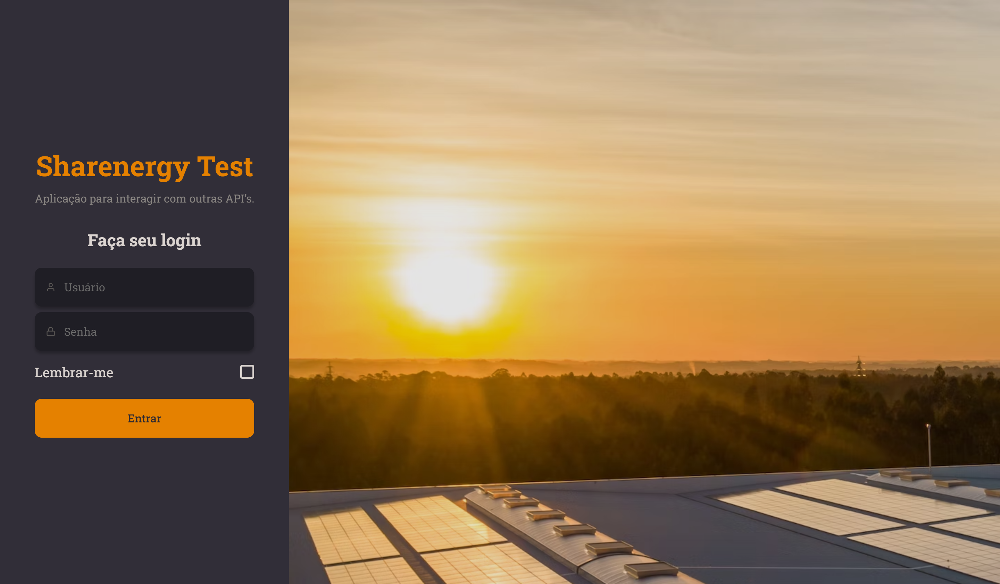
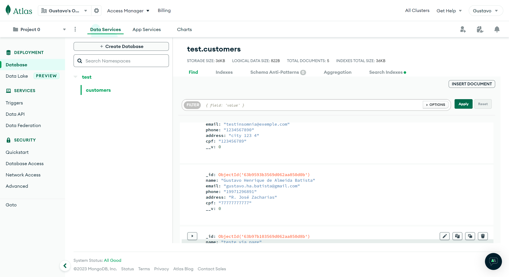

<h1 align="center"> Sharenergy Test </h1>

Tip: Por favor, use o comando `ctrl shift v` para visualizar o README.md no VSCode com o Markdown Preview Enhanced e assim ter uma melhor experiência de leitura.

  <a href="#-tecnologias">Tecnologias</a>&nbsp;&nbsp;&nbsp;|&nbsp;&nbsp;&nbsp;
  <a href="#-projeto">Projeto</a>&nbsp;&nbsp;&nbsp;&nbsp;&nbsp;&nbsp;</a>

 

  

## 🚀 Tecnologias

Esse projeto foi desenvolvido com as seguintes tecnologias:

Frontend: ReactJS & TypeScript;

- [ReactJS](https://reactjs.org) (ReactJS)
- [TypeScript](https://www.typescriptlang.org/) (TypeScript)
- [Vite](https://vitejs.dev/) (Bundler)
- [Styled Components](https://styled-components.com/) (CSS)
- [Axios](https://axios-http.com/) (API)

Backend: NestJS & TypeScript;

- [NestJS](https://nestjs.com/) (NestJS)
- [TypeScript](https://www.typescriptlang.org/) (TypeScript)
- [Jest](https://jestjs.io/) (Testes)
- [Axios](https://axios-http.com/) (API)
- [MongoDB](https://www.mongodb.com/) (Banco de Dados)
- [Mongoose](https://mongoosejs.com/) (ORM)

## 💻 Projeto

O projeto foi desenvolvido para o teste da Sharenergy, onde o objetivo era criar uma aplicação que consumisse API's distintas além de um CRUD de clientes.

 
 

## 🚀 Como executar

- Escopo: O projeto foi desenvolvido com o intuito de ser executado em ambiente de desenvolvimento local, portanto, não foi feito deploy para produção. Para executar o projeto, é necessário ter o NodeJS instalado em sua máquina.

#### Inicializando o frontend:

- Clone o repositório.
- cd frontend && `npm install` ou `yarn install` para instalar as dependências.
- `npm run dev` ou `yarn dev` para iniciar o servidor de desenvolvimento.

#### Inicializando o backend:

- cd backend && `npm install` ou `yarn install` para instalar as dependências.
- `npm run start:dev` ou `yarn start:dev` para iniciar o servidor de desenvolvimento e ter acesso ao banco de dados e a API.

Feito isso, o projeto estará disponível e pronto para ser avaliado em seu navegador pelo endereço http://localhost:5173.

#### Entre com as seguintes credenciais:

> username: `desafiosharenergy`

> password: `sh@r3n3rgy`

 
 

## 📝 Documentação

- [Documentação da API com Swagger](https://app.swaggerhub.com/apis-docs/GUSTAVOHABATISTA/sharenergy-test_gustavo_batista/1.0#/)

  > Minhas rotas que desenvolvi no NestJS e usei o Insomnia para testar as rotas e exportei para o Swagger para documentar a API.

- [Documentação com Figma](https://www.figma.com/file/CQpvUqcAroGJazWeR9wvrj/Sharenergy-2023-01?node-id=0%3A1&t=MDNj53bAMu08bb9u-1)

  > Fiz um protótipo no Figma para ter uma ideia de como ficaria a aplicação.

- [MongoDB Atlas](https://www.mongodb.com/cloud/atlas)

  > Utilizei o MongoDB Atlas para hospedar o banco de dados da aplicação.

  

    
  

 
 

## 📃 Testes

- A aplicação foi desenvolvida com o intuito de ser testada, portanto, foi utilizado o Jest para testar algumas funcionalidades. Para executar os testes, basta executar o comando `npm run test` ou `yarn test` no terminal dentro do diretório do backend.

 
 

## 📺 Video de apresentação do projeto no YouTube

- [Video de apresentação do projeto no YouTube](https://youtu.be/vq36kC7zVKE)

 
 

## 💌 Agradecimentos

- Agradeço a oportunidade de participar do processo seletivo da Sharenergy, foi uma experiência incrível e inesquecível. Foi muito divertido desenvolver esse projeto e espero que assim como eu, vocês gostem do resultado final. 🧡

---

Feito com ♥ by Gustavo Batista :wave: [LinkedIn](https://www.linkedin.com/in/gustavo-h-batista/) e [GitHub](https://github.com/gustavohdab)
